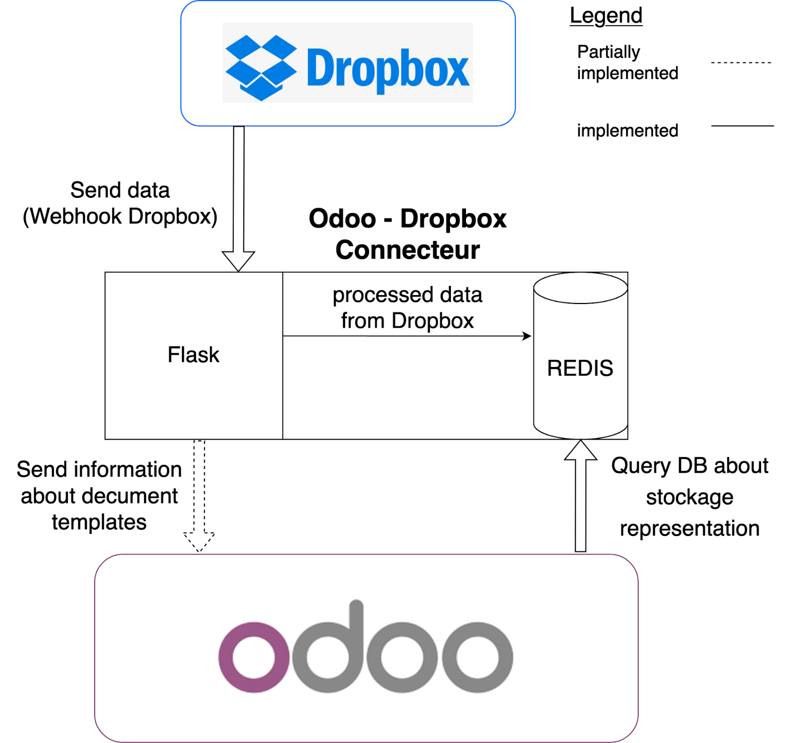

# odoo-dropbox-connector
The Odoo - Dropbox connector takes care of some of the connections made between Odoo and Dropbox. For an overview, see the diagram below

## Requirements
  1. Docker & Docker-compose.
  2. A Dropbox Account & Registered webhook.
  3. A public address pointing to your server running this application.

## Deployement

### Run the server
`docker-compose up` at the root project will run the Flask server at the port `8006` and the redis database at port `6379`. To ensure that the server is running, an Hello world page is accessible at the base_url. 

### Connection with Odoo
The connection (so far) are only initated by Odoo. Therefore, please change the redis URL in the `.env` of the [odoo-fitspro](https://github.com/Hyoko-ACDC/odoo-fitspro) 

### Connection with Dropbox
 Register your app in [here](https://www.dropbox.com/developers/apps) and register the webhook that points to this application.

  
## Environment 
The connector is containerized. Thus, it includes a `docker-compose.yml` file which defines a Redis database in version 6.2 and a Flask 2.0.2 server with python 3.9.1. 

The external python libraries that the Flask server uses are the following: `Flask==2.0.2`, `dropbox==11.18.0`, `redis`, `python-dotenv`, `validators`, `hiredis`, `tqdm` 

Any change and saving of the computer code will cause a refresh of the code within the server and recreate the dropbox representation in redis.

An .env file must be present in the odoo-dropbox-connector/flask folder. It contains the environment variables and is loaded by the Flask server code at launch. A `.env_sample` file is left to get inspiration (the `.env` file we used is left in the documentation). 

## Tasks of the connector

The tasks performed by this connector are the following:
  1. Maintains a representation of the state of the student and teacher DMS (Document Managment System) tree in dropbox by means of a webhook (see Dropbox section point on installing the Dropbox environment).

  2. Returns this representation when the ERP requests it (this happens when a user wants to upload or delete a file in a storage space)

  3. Transmits to Odoo any change in the document templates (see the Dropbox section in the Documentation).

## Implementation
At launch, the Flask server automatically parse Dropbox and fill the Redis database (see [load_user_dms](https://github.com/Hyoko-ACDC/odoo-dropbox-connector/blob/main/flask/utils.py#L542-L567)).

### Global structure
In the flask folder two files compose the server: 
  * `utils.py` defines useful functions for handling webhook POSTs and such. 
  * `main.py` acts as a reverse proxy depending on the incoming request or POST

### Redis registers
There are 4 registers in Redis: 
  * `dmsFitspro` : Contains a folder_id mapping to a dictionary which is nothing but a representation of that folder's tree structure (having folder_id as id) in Dropbox.

  * `dmsUserIdMapping`: Contains a folder_id to user_name mapping

  * `dmsDocumentTemplates` : Registry dedicated to the document template present in the admin/document templates folder (Implementation not complete).

  * `Subscribers`: This last registry is used to retrieve the address of Odoo instances to notify them that changes have been made in the document template folder (Implementation not complete).

## Tests
A test folder is provided to be sure that the architecture representations are well synchronized between Dropbox and Redis. The tests take a few minutes to complete because they wait for the Dropbox webhook to activate. Be careful, these tests should only be run in a development environment because they create users in Dropbox and upload files to their storage spaces, although they delete them afterwards. An .env file with the same structure as the .env file introduced above must also be provided at the root of the test folder (important to dissociate test and production environments). We have used the `pytest` library to create these tests.
